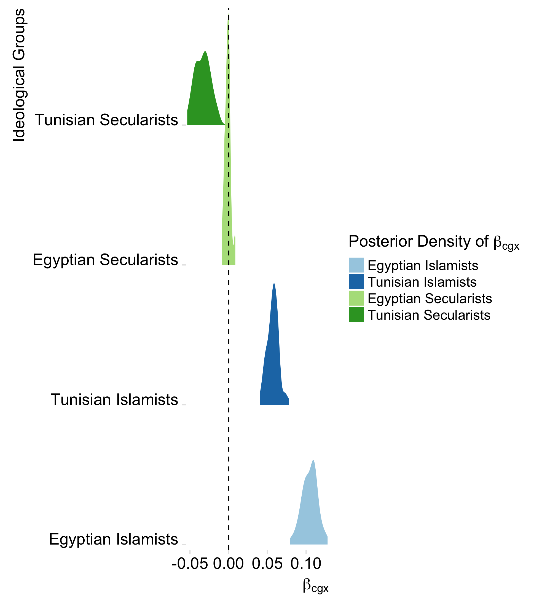

```{r setup, include=FALSE}

# please install this version of idealstan on github to ensure compatibility with this document

# devtools::install_github('saudiwin/idealstan',
#                           ref='cf3cb51fb620fa48d49fb602ad6a747782e964af')

require(dplyr)
require(ggplot2)
require(forcats)
require(tidyr)
require(readr)
knitr::opts_chunk$set(echo = TRUE,fig.align = 'center',fig.width=8,fig.height=6,echo=F,warn=F,message=F)
```

## The Problem in Measuring Over-time Transnational Polarization


```{r polar3,out.width='58%',echo=F}
knitr::include_graphics('TransnationalPolarization.jpg')

```

## Data

- 155 elite (high-profile) Twitter users (personal accounts) from Egypt and Tunisia
- Code each by Islamist/secularist affiliation.
- Full timelines & retweets of each elite user from March 31st 2013 to December 31st 2013.
- Outcome: count of retweets of each elite user's tweet by all other Twitter users by day
- 1,835,824 citizen-elite interactions with 96,848 unique citizens
- Event of interest: Egyptian military overthrows democratically elected government (Islamists) on July 3, 2013.


## Too Much Data, Too Little Time

- We want to derive a theoretically justifiable and statistically accurate measaure of *transational* polarization happening between and across sectarian groups within countries.
- We also want this measure to vary over time and to allow us to test for the effect of covariates (i.e., the coup) on transnational polarization.
- We want to take into account the fact that Twitter users' attention to tweets is *not* randomly distributed.
- To do so, we combine different models to produce an item-response theory model with vector auto-regression (IRT-VAR).

## Building Block 1: Item Response Theory


- The ideal point variant of the item response theory (IRT) model has been used in political science for two decades and follows a simple form:

$$
Y_{ijt} = \alpha_j x_{cg} - \beta_j
$$

- $\alpha_j =$ Discrimination parameter for citizen $j$
- $x_{cg} =$ Ideal points of each elite $i$ by sectarian group $g$ and country $c$
- $\beta_j =$ Difficulty parameter for citizen $j$


## Building Block 2: Account for Selection into Tweeting

- In a previous paper Kubinec (2017) implemented a form of a hurdle model that uses a first-stage estimation to account for differing probabilities $r$ of seeing a tweet
- The first stage is an ancillary IRT model with additional parameters for each citizen but the same parameters for the sectarian groups (ideal points $x_{cg}$)

$$
\small
	L(\beta_j,\alpha_j,x_{cg}|Y_{ijtr}) = 
	\prod_{I}^{i=1} \prod_{J}^{j=1}
	\begin{cases}
	\zeta(x_{cg}'\gamma_j - \omega_j ) & \text{if } r=0, \text{ and} \\
	(1-\zeta({x_{cg}'\gamma_j - \omega_j}))L(\beta_j,\alpha_j,x_{cg}|Y_{ijt1}) & \text{if } r=1
	\end{cases}
$$

## Vary over Time

- To track the ideal points over time we index $x_{cg}$ by $t$ to result in one ideal point per time period of one day. 

$$
x_{cgt}
$$

## Endogeneity

- Finally, we need to allow these ideal points to influence each other *across national boundaries*.
- Our method for this madness is vector auto-regression.
- Each ideal point $x_{cgt}$ is a function of its own prior value $x_{cg(t-1)}$ and the prior period lag of its foreign compatriot $x_{-cg(t-1)}$

$$
\small
x_{cgt} = \gamma_{cg} + \beta_{cgIN}x_{cgt-1} + \beta_{cgOUT}x_{-cgt-1} + \beta_{cgx}X  + \epsilon_{cgt}
$$

## All About That Bayes

- To put it together, we assign prior distributions to all parameters.
- The autocorrelation process of $x_{cgt}$ is included in the prior distribution of $x_{cgt}$

$$
\small
x_{cgt}\sim N(\gamma_{cg} + \beta_{cgIN}x_{cgt-1} + \beta_{cgOUT}x_{-cgt-1} + \beta_{cgx}X , \sigma_{cgt})
$$

## Full Joint Posterior

$$
\small
\begin{align}
p(\theta,\lambda|Y_{cgjt}\neq0,Y_{cgjt}=0) \propto& p(\theta)p(\lambda) \cdot \\
&[ L(Y_{cgjt}=0|\lambda) + (1-L(Y_{cgjt}=0|\lambda))L(Y_{cgjt}\neq0|\theta)]
\end{align}
$$

- $\theta$ is the full set of unobserved IRT parameters for the observed data (counts of retweets per day)
- $\lambda$ is the full set of unobserved IRT parameters for the unobserved data (zero inflation)

## Sampling 

- Estimating the full joint posterior involves sampling almost 200,000 parameters.
- To address this, we employ the variational Bayesian sampler in Stan (Carpenter et al. 2017).
- Estimation still requires about one day to finish, showing the upper bound of Bayesian modeling.

## Payoff: Time-varying Ideal Points by Sectarian Groups

```{r payoff1,out.width='100%',echo=F}
knitr::include_graphics('arab_ideology.png')

```

## Payoff: Covariate Estimation: Effect of Coup

```{r payoff2,out.width='50%',echo=F}


```

## Payoff: Ideal Point Impulse Response Functions

```{r payoff3,out.width='50%',echo=F}


```

## Don't Take My Word For It... Read More Online!

- Paper available on SocArchiv: https://osf.io/preprints/socarxiv/wykmj/
- Github repository with source code (including Stan files) and data: https://github.com/saudiwin/arab_polarization
