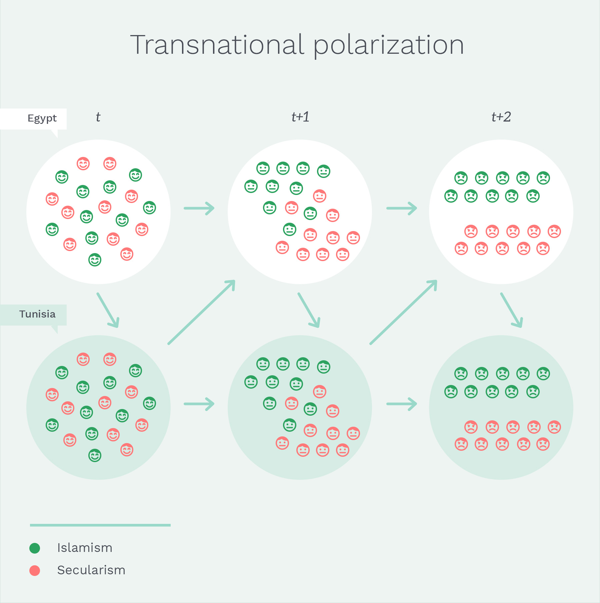
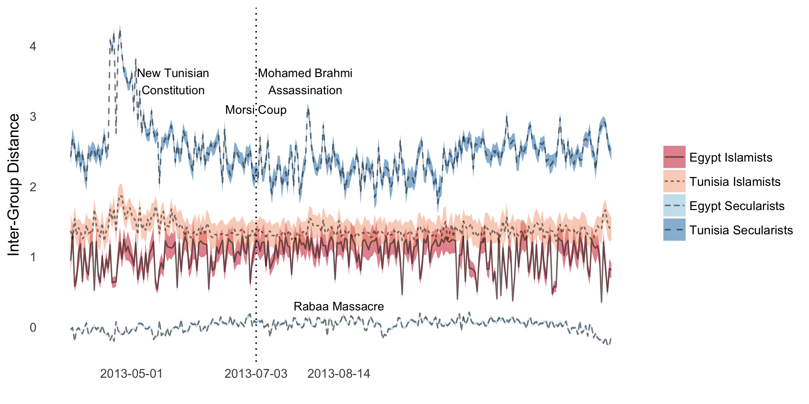

A Richter Scale for Cross-National Polarization: Islamist-Secularist Protest during the  Arab Uprising
========================================================
author: Robert Kubinec and John Owen
date: April 21, 2018
autosize: true
incremental: true

A Long, Long Time Ago in a Grad Conference Far Away...
========================================================

Research Question
========================================================

Can we measure transnational ideological polarization using Twitter data that shows the endogenous process of ideological groups reacting to each other across borders?

========================================================

========================================================

========================================================

Hypothesis 1
================

As the latent ideological position of Islamists or secularists changes, the latent ideological position in the like-minded group in the other state will also change.

Hypothesis 2 
================
After the coup against Mohammed Morsi, the difference in latent ideological positions between Islamists and secularists will diverge in direct reaction to the coup (direct effect).

Hypothesis 3
================
After the coup against Mohammed Morsi, the difference in latent ideological positions between Islamists and secularists will diverge from each group's reaction to their ideological allies' shift in latent ideological position (indirect effect).

Hypothesis 4
====================
After the coup against Mohammed Morsi, the difference in latent ideological positions between Islamists and secularists from the direct reaction to the coup and each group's reaction to their ideological allies' shift will be greater than the direct reaction to the coup alone (combined effect).

Data Collection 
==========

- We collected a dataset of 155 Twitter users from Egypt and Tunisia with large personal followings.
- We coded them into Islamists and secularists, giving us 4 groups (Egypt-Secularist, Tunisia-Secularist, Egypt-Islamist, Tunisia-Islamist).
- We then collected all of their tweets from March 31st, 2013 to December 31, 2013. 
- For each tweet, we collected all re-tweets, and recorded those users, giving us 1.8m citizen-elite interactions.
- For each 24-period, we have the number of retweets that each citizen retweeted each elite.

========================================================

Model: IRT-VAR
=======
- We designed a new model combining two existing approaches:
  1. Item-response theory
  2. Vector-autoregression
- The first is for measurement.
- The second is for feedback effects.

Simulated Example
=======

Auto-Correlated IRT
=====
$$
\begin{aligned}
y_{cgt} &= \gamma_{cg} + \beta_{cgIN}y_{cgt-1} + \beta_{cgOUT}x_{-cgt-1} + \epsilon_{cgt}\\
x_{-cgt} &= \gamma_{-cg} + \beta_{-cgIN}x_{-cgt-1} + \beta_{-cgOUT}y_{cgt-1} + \epsilon_{-cgt}
\end{aligned}
$$

Over-time Results
=====

Level of Feedback - Impulse Response Function
=======

Combined Effect - Impulse Response Function
======

